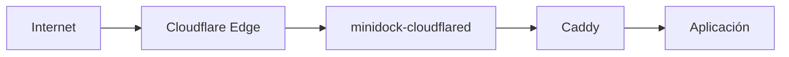

# Cloudflare Tunnel sin instalación manual

MiniDock publica aplicaciones locales en Internet sin abrir puertos del router,
sin una IP estática y sin instalar `cloudflared` en el host. El conector oficial
se ejecuta como un contenedor aislado que MiniDock crea y mantiene mediante su
proxy Docker restringido.

## Flujo recomendado: automático

1. En Cloudflare crea un API Token con estos permisos mínimos:
   - `Zone / DNS / Edit`, limitado a las zonas que publicarás.
   - `Account / Cloudflare Tunnel / Edit`, limitado a tu cuenta.
2. Copia el **Account ID** de 32 caracteres de la cuenta.
3. En MiniDock abre **Cloudflare Tunnel**, selecciona **Automático**, pega ambos
   valores y pulsa **Guardar y conectar automáticamente**.

MiniDock realiza el resto:

- valida el API Token;
- crea un túnel remoto con un nombre único para esa instalación;
- obtiene y cifra el Tunnel Token;
- configura cada dominio público hacia `http://caddy:80` y termina la lista de
  ingreso con una respuesta 404;
- crea los CNAME proxied en las zonas permitidas;
- descarga la imagen oficial y arranca `minidock-cloudflared`;
- consulta a Cloudflare para distinguir una conexión saludable, degradada o
  todavía inactiva.

Cuando se asigna posteriormente un dominio público a una aplicación, MiniDock
actualiza automáticamente la configuración remota y el DNS. El botón
**Reparar o reiniciar conector** permite reconciliar el contenedor sin volver a
pegar las credenciales.

## Túnel existente (avanzado)

También se puede pegar un Tunnel Token obtenido en Cloudflare Zero Trust.
MiniDock cifra el token y administra el contenedor, pero no puede modificar las
rutas remotas ni el DNS sin un API Token. Esa configuración permanece bajo
responsabilidad del operador en el panel de Cloudflare.

## Controles de seguridad

- Los tokens se cifran con AES-256-GCM en SQLite y nunca se escriben en `.env`.
- El Tunnel Token no se incluye en los argumentos del proceso Docker ni en los
  logs de MiniDock; se entrega al cliente Docker mediante su entorno efímero.
- El contenedor no publica puertos, solo se conecta a `minidock-edge`, usa raíz
  de solo lectura, elimina todas las capacidades Linux y activa
  `no-new-privileges`.
- Tiene límites de memoria, CPU, procesos y rotación de logs.
- La imagen usa una versión explícita en vez de una etiqueta mutable `latest`;
  puede actualizarse conscientemente con `MINIDOCK_CLOUDFLARED_IMAGE`.
- MiniDock solo actualiza o elimina contenedores con sus etiquetas de propiedad.
- En una actualización desde el servicio Compose anterior, la migración solo
  elimina `cloudflared` si pertenece al mismo proyecto Compose que MiniDock.
- Desactivar el túnel elimina el conector, pero conserva las credenciales
  cifradas para facilitar una reactivación. Revoca el API Token en Cloudflare si
  deseas retirar también la autorización externa.

Para los endpoints y estados utilizados, consulta la documentación oficial de
[Cloudflare Tunnels API](https://developers.cloudflare.com/api/resources/zero_trust/subresources/tunnels/).
