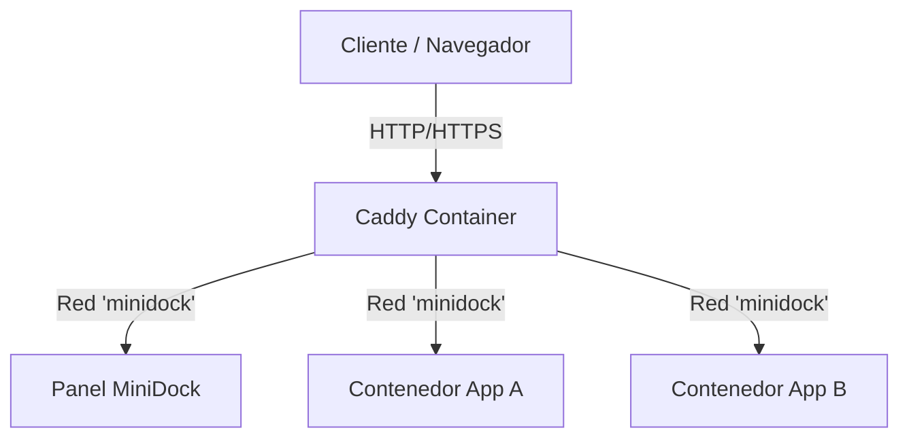

# Proxy, red y dominios

MiniDock utiliza **Caddy** para la gestión del tráfico y enrutamiento dinámico de las aplicaciones. MiniDock actualiza las rutas de aplicaciones mediante el Admin API JSON privado de Caddy; no depende de etiquetas Docker para hacer la conmutación.

---

## 1. Arquitectura de Red y Exposición

Tanto el panel de MiniDock como los contenedores desplegados conviven en una red Docker común llamada `minidock`.



- **Red unificada:** La red `minidock` permite que Caddy alcance los puertos internos de cada contenedor directamente mediante DNS interno de Docker (usando el nombre de host de Docker).
- **Plano de control privado:** Caddy expone su Admin API solo en la red interna `control`; no tiene un puerto publicado. MiniDock es el único cliente configurado mediante `MINIDOCK_CADDY_ADMIN_URL`.

---

## 2. Separación del Dominio Administrativo

Para evitar secuestros de tráfico, colisiones accidentales de rutas u otros riesgos de seguridad, el dominio administrativo de MiniDock y los dominios públicos de las aplicaciones se encuentran estrictamente separados:

1. **Dominio Administrativo (`MINIDOCK_ADMIN_DOMAIN`):**
   - El binario acepta esta variable. El `compose.yaml` actual no la inyecta;
     debe corregirse en `MD-P0-01` antes de depender de ella en producción.
   - Controla el acceso al panel administrativo de MiniDock.
   - Por defecto es `localhost` en desarrollo.
2. **Validación de Colisiones:**
   - Al registrar una nueva aplicación en el asistente de MiniDock, el sistema valida que el dominio público ingresado por el operador no coincida con el dominio administrativo actual. Si coinciden, la petición es rechazada con un error explicativo.

---

## 3. Resolución de Nombres (DNS)

### Desarrollo Local
Para que dominios como `api.local` o `mi-app.test` resuelvan en tu máquina local:

- **Opción A (Archivo de Hosts):**
  Añade una línea al archivo `/etc/hosts` (o `C:\Windows\System32\drivers\etc\hosts` en Windows):
  ```text
  127.0.0.1  api.local mi-app.test
  ```
- **Opción B (DNS Local con dnsmasq):**
  Para resolver automáticamente todos los subdominios de `.local` o `.test` a `127.0.0.1`, instala `dnsmasq` y añade:
  ```text
  address=/.local/127.0.0.1
  address=/.test/127.0.0.1
  ```

### Producción
- Configura registros DNS de tipo **A** (o **AAAA**) en tu proveedor de DNS (Cloudflare, Route53, etc.) apuntando a la IP pública del servidor host donde corre MiniDock.

---

## 4. Configuración de TLS y Certificados

### Desarrollo Local (Certificados de desarrollo)
Caddy genera automáticamente certificados locales autofirmados a través de su autoridad de certificación (CA) interna cuando el dominio termina en `.localhost` o `.local`.
- Si utilizas dominios locales y accedes por HTTPS, Caddy creará los certificados. Deberás instalar la CA de Caddy (`root.crt`) en el llavero de tu sistema o navegador si quieres evitar advertencias de seguridad de conexión.

### Producción (TLS Público)
- Cuando el puerto 80 y 443 están expuestos públicamente y el dominio apunta a la IP de tu servidor, Caddy solicitará e instalará automáticamente certificados válidos de **Let's Encrypt** o **ZeroSSL**.
- El aprovisionamiento de certificados ocurre en el arranque del contenedor de la aplicación y Caddy gestiona su renovación automática de fondo sin interrumpir el servicio.

---

## 5. Proceso de Sonda de Ruta y Pre-verificación

El motor comprueba la ruta después de la conmutación mediante el endpoint de
health configurado para la aplicación (o `/` si no se configuró uno). La
sonda exige el estado `MINIDOCK_PROXY_EXPECTED_STATUS` (por defecto `200`) y,
si se configuró `MINIDOCK_PROXY_EXPECTED_CONTENT`, que la respuesta contenga
ese fragmento. Una redirección, un `5xx` o contenido distinto no acredita la
ruta ni permite marcar el release como exitoso. Cada sonda queda persistida
con fecha, observador y estado HTTP; el SLO usa ese historial.

1. **Creación y Health Interno:** Se arranca el nuevo contenedor en modo candidato, verificando su `/healthz` local.
2. **Conmutación del Proxy:** Una vez saludable internamente, MiniDock reemplaza atómicamente el upstream de la ruta de Caddy por el candidato. El contenedor activo se conserva hasta que la sonda externa acredita la ruta nueva.
3. **Sonda HTTP de proxy:**
   - MiniDock realiza peticiones HTTP de fondo a `MINIDOCK_PROXY_URL` (por defecto `http://localhost` o el contenedor de Caddy) inyectando el header `Host: <dominio-de-la-app>`.
   - El probe se repite periódicamente (con un timeout máximo de 30s).
   - Se considera exitosa únicamente con el status y contenido configurados en
     la ruta configurada. La
     redirección no se sigue, para evitar que una respuesta arbitraria o una
     pantalla de login se confunda con la aplicación saludable.
   - Si la sonda falla o agota el tiempo de espera, la conmutación se considera fallida y el release se revierte automáticamente al contenedor anterior.
